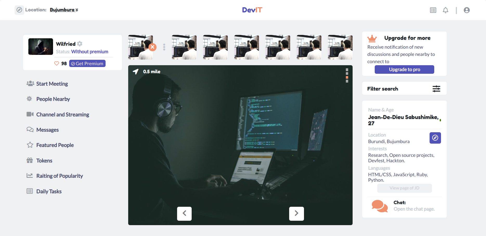
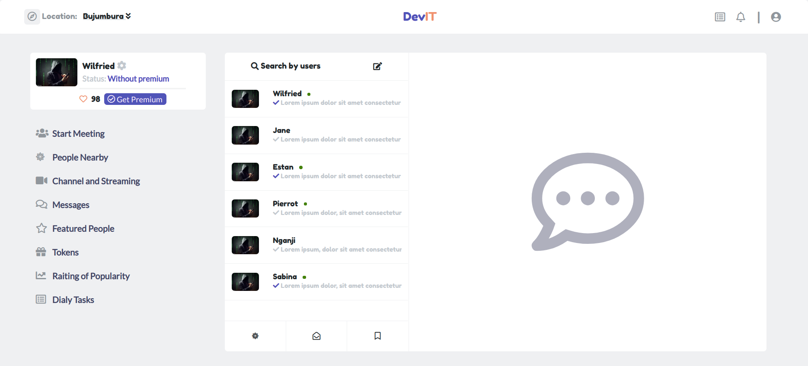

<!-- PROJECT LOGO -->

 

   <h3 align="center">DevIT App</h3>

  

    A simple application for developers.
         
     
    ·
     <a href="https://wcanirinka.github.io/Developers-social-app/">Live Demo</a>
    ·    
  

<!-- TABLE OF CONTENTS -->
## Table of Contents

* [About the Project](#about-the-project)
  * [How to Contribute](#how-to-contribute)
  * [Link to presentation video](#link-presentation)
  * [Built With](#built-with)
* [Contact](#contact)
* [Acknowledgements](#acknowledgements)

<!-- ABOUT THE PROJECT -->
## About The Project

  I am Wilfried. I am part of the Microverse Project and I build this application as part of the capstone project. The project is about an application that allow developers to be able to chat or find developers in your location and be able to chat about projects that you can work on or organize meet-ups and also be able to interact.

* [Project details](#project-details)

  * [Project Specification](#project-specification)

      - Behance Link  [https://www.behance.net/gallery/70285515/Swipex-This-application-for-dating](https://www.behance.net/gallery/70285515/Swipex-This-application-for-dating)

      Capstone projects are solo projects at the end of the each of the Microverse Main Technical Curriculum sections. Building this project is very important for you because:

      - It's a real-world-like project, built with business specifications that will look really nice in your portfolio; and
      - You will get feedback about the achievement of technical and soft skills gained during this section of the program.

      The project you are going to build for the HTML & CSS capstone is based on social network to find acquittances. You should follow the given design of the website, but you can personalize the content, i.e., instead of finding acquittances you can build a network of employees in a company or a network of professional contacts. It's a good idea to personalize your project, so that you have something unique to share with potential employers during your job search.

      Whatever the objective for the network you may choose, you should build these 3 pages as the minimum requirements:

      - the person detail page, with a link to the next/previous person detail and a link to the chat page
        
      - the chat page, with a list of chats that link to the chat detail page
        
      - the chat detail page
        

    Each of these pages should have versions for 2 different screen sizes: 

      - mobile & tablet: up to 1024px
      - desktop: from 1024px

    You should follow the guidelines of the given design, including:

      - colors
      - typographies: font face (as Helvetica Neue is a paid font, you may use a similar one like Open Sans), size and weight
      - layout: composition and space between elements, for the 2 given screen sizes

  * [Assessment Criteria](#assessment-criteria)

      After the project submission, we will assess the project following these criteria, including technical and soft-skills:

      - Use semantic HTML tags
      - Use CSS selectors correctly
      - Use HTML elements box model (margin, padding, width, height).
      - Use industry-standard tools (flexbox) to place elements in the page.
      - Ability to create UIs adaptable to different screen sizes using mediaqueries.
      - Apply front-end best practices.
      - Ability to create UIs adjusted to given designs.
      - Strong English written and verbal communication.
      - Ability to communicate information effectively to technical and non-technical people.
      - Ability to translate business requirements into software solutions.
      - Ability to work well in a fast-paced environment under deadlines.
      - Ability to perform tasks and complete projects with minimal supervision.

  * [Assessment Result](#assessment-criteria)
  
      You final result is [Mastery]()

      [Learning objectives]()

      - Use semantic HTML tags. [Mastery]()
      - Use CSS selectors correctly. [Mastery]()
      - Use HTML elements box model (margin, padding, width, height). [Mastery]()
      - Use industry-standard tools (flexbox) to place elements in the page. [Competence]()
      - Ability to create UIs adaptable to different screen sizes using mediaqueries. [Mastery]()
      - Apply front-end best practices. [Mastery]()
      - Ability to create UIs adjusted to given designs. [Mastery]()
      - Strong English written and verbal communication. Mastery
      - Ability to communicate information effectively to technical and non-technical people. [Mastery]()
      - Ability to translate business requirements into software solutions. [Mastery]()
      - Ability to work well in a fast-paced environment under deadlines. [Mastery]()
      - Ability to perform tasks and complete projects with minimal supervision. [Mastery]()

### Link to presentation video

* Video Presentation - [https://www.loom.com/share/2c9fe6d080ea4f4eb29a83b5642fa497](https://www.loom.com/share/2c9fe6d080ea4f4eb29a83b5642fa497)

### Contributing

Thank you for considering contributing to this Project. Please read the following guidelines <a href="https://github.com/MarcDiethelm/contributing/blob/master/README.md">here</a> for more details. 

### Tests
* stickler-ci
* stylelint
* [W3C Validator](https://validator.w3.org/#validate_by_upload)

### Build With

* [Html]()
* [CSS]()
* [Bootstrap]()
* [VSCODE]()

### Contact
* Wilfried - [@WCanirinka](https://twitter.com/WCanirinka)  - [LinkedIn](https://www.linkedin.com/in/wilfried-canirinka-884ab0b6/) - [GitHub](https://github.com/WCanirinka)
* Project Link [https://wcanirinka.github.io/Developers-social-app/](https://wcanirinka.github.io/Developers-social-app/)

### Acknowledgements

* [GitHub](https://github.com)
* [VSCODE]()
* [StyleLint]()
* [Stickler]()
